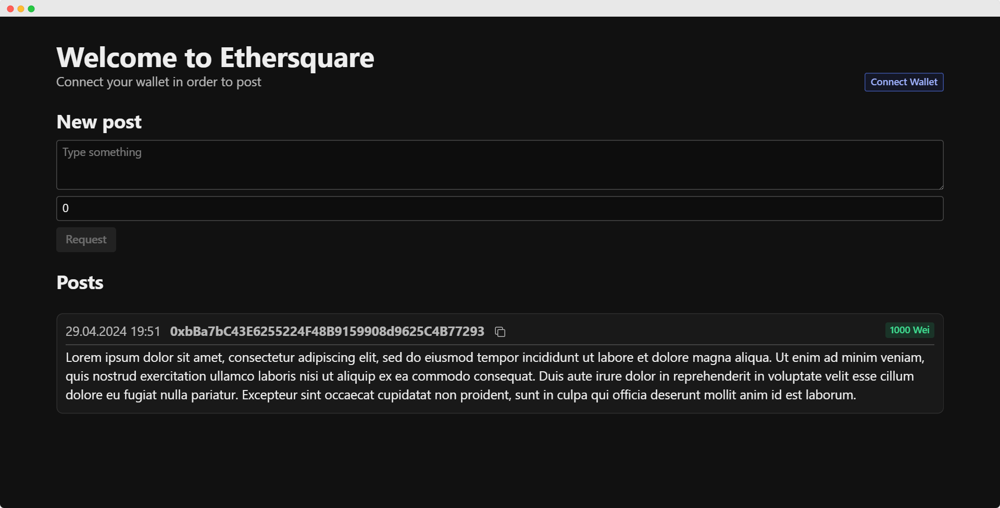

# Ethersquare

Ethersquare is a decentralized social network deployed on Etherum Sepolia Testnet. It allows users to post text messages and include a voluntary, public fee that goes to
the contract. This is a way to reduce spam. The client is build with React and Radix UI component library.

- [Contract on Etherscan](https://sepolia.etherscan.io/address/0x26F83A3c2987FDDfcde1909CAF6BB5Af0355CD8A)
- [Contract ABI](./react-app/src/Ethersquare.json)
- [Sepolia ETH proof-of-work faucet](https://sepolia-faucet.pk910.de/)
- [Radix UI](https://www.radix-ui.com/)

If you need Sepolia ETH for testing and don't want to use the faucet, feel free to reach out to me.
